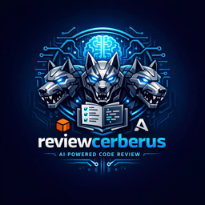

# ReviewCerberus

<p align="center">
  
</p>

AI-powered code review tool that analyzes git branch differences and generates
comprehensive review reports with executive summaries.

## Key Features

- **Three Review Modes**: Full (comprehensive), Summary (high-level), Spaghetti
  (code quality)
- **Executive Summaries**: Auto-generated highlights of critical issues
- **Multi-Provider**: AWS Bedrock or Anthropic API
- **Smart Analysis**: Token-efficient tools with prompt caching
- **Git Integration**: Works with any repository, supports commit hashes

______________________________________________________________________

## Quick Start

Run with Docker (recommended):

```bash
docker run --rm -it -v $(pwd):/repo \
  -e MODEL_PROVIDER=anthropic \
  -e ANTHROPIC_API_KEY=sk-ant-your-api-key \
  kirill89/reviewcerberus-cli:latest \
  --repo-path /repo --output /repo/review.md
```

**That's it!** The review will be saved to `review.md` in your current
directory.

See [Configuration](#configuration) for AWS Bedrock setup and other options.

______________________________________________________________________

## Usage

### Basic Commands

```bash
# Default: full review with executive summary
poetry run reviewcerberus

# Choose review mode
poetry run reviewcerberus --mode full       # Detailed analysis
poetry run reviewcerberus --mode summary    # High-level overview
poetry run reviewcerberus --mode spaghetti  # Code quality focus

# Custom target branch
poetry run reviewcerberus --target-branch develop

# Custom output location
poetry run reviewcerberus --output /path/to/review.md
poetry run reviewcerberus --output /path/to/dir/  # Auto-generates filename

# Different repository
poetry run reviewcerberus --repo-path /path/to/repo

# Add custom review guidelines
poetry run reviewcerberus --instructions guidelines.md

# Skip executive summary (faster)
poetry run reviewcerberus --no-summary
```

### Example Commands

```bash
# Full review with custom guidelines
poetry run reviewcerberus --mode full --target-branch main \
  --output review.md --instructions guidelines.md

# Quick summary for a different repo
poetry run reviewcerberus --mode summary --repo-path /other/repo

# Code quality check without summary
poetry run reviewcerberus --mode spaghetti --no-summary
```

______________________________________________________________________

## Review Modes

### 1. Full Review (Comprehensive Analysis)

Detailed code review covering:

- **Logic & Correctness**: Bugs, edge cases, error handling
- **Security**: OWASP issues, access control, input validation
- **Performance**: N+1 queries, bottlenecks, scalability
- **Code Quality**: Duplication, complexity, maintainability
- **Side Effects**: Impact on other system parts
- **Testing**: Coverage gaps, missing test cases

### 2. Summary Mode (High-Level Overview)

Concise overview including:

- Brief description of changes (2-4 sentences)
- Task-style description and logical grouping
- User impact and new components
- System integration overview

### 3. Spaghetti Mode (Code Quality Analysis)

Focuses on code maintainability:

- **Code Duplication**: Within changes and across codebase
- **Reuse Opportunities**: Existing functions/classes to leverage
- **Redundancy**: Repeated checks and validations
- **Library Usage**: Standard library or dependency suggestions
- **Abstraction**: Opportunities for better patterns
- **Dead Code**: Unused imports, unreachable code
- **Over-Engineering**: Unnecessary complexity

### Executive Summary (All Modes)

Every review includes an auto-generated summary at the top:

- Top 3-5 critical issues with locations
- Issue counts by severity (🔴 CRITICAL, 🟠 HIGH, 🟡 MEDIUM, ⚪ LOW)
- Actionable recommendations

Disable with `--no-summary` for faster reviews.

______________________________________________________________________

## How It Works

1. **Detects** current git branch and repository
2. **Compares** changes between current branch and target branch
3. **Analyzes** using AI agent with specialized tools:
   - List changed files
   - Read file contents with line ranges
   - View git diffs with pagination
   - Search patterns across codebase
   - Review commit messages
4. **Generates** markdown review report with executive summary

**Progress Display:**

```
Repository: /path/to/repo
Current branch: feature-branch
Target branch: main

Found 3 changed files:
  - src/main.py (modified)
  - src/utils.py (modified)
  - tests/test_main.py (added)

Starting code review...

🤔 Thinking... ⏱️  3.0s
🔧 changed_files
🔧 diff_file: src/main.py
📊 Generating executive summary...

✓ Review completed: review_feature-branch.md

Token Usage:
  Input tokens:  6,856
  Output tokens: 1,989
  Total tokens:  8,597
```

______________________________________________________________________

## Configuration

All configuration via environment variables (`.env` file):

### Provider Selection

```bash
MODEL_PROVIDER=bedrock  # or "anthropic" (default: bedrock)
```

### AWS Bedrock (if MODEL_PROVIDER=bedrock)

```bash
AWS_ACCESS_KEY_ID=your_key
AWS_SECRET_ACCESS_KEY=your_secret
AWS_REGION_NAME=us-east-1
MODEL_NAME=us.anthropic.claude-sonnet-4-5-20250929-v1:0  # optional
```

**Docker example with Bedrock:**

```bash
docker run --rm -it -v $(pwd):/repo \
  -e AWS_ACCESS_KEY_ID=your_key \
  -e AWS_SECRET_ACCESS_KEY=your_secret \
  -e AWS_REGION_NAME=us-east-1 \
  kirill89/reviewcerberus-cli:latest \
  --repo-path /repo --output /repo/review.md
```

### Anthropic API (if MODEL_PROVIDER=anthropic)

```bash
ANTHROPIC_API_KEY=sk-ant-your-api-key-here
MODEL_NAME=claude-sonnet-4-5-20250929  # optional
```

### Ollama (if MODEL_PROVIDER=ollama)

```bash
MODEL_PROVIDER=ollama
OLLAMA_BASE_URL=http://localhost:11434  # optional, default
MODEL_NAME=devstral-small-2:24b-cloud   # optional
```

**Docker example with Ollama:**

```bash
# Assumes Ollama running on host machine
docker run --rm -it -v $(pwd):/repo \
  -e MODEL_PROVIDER=ollama \
  -e OLLAMA_BASE_URL=http://host.docker.internal:11434 \
  kirill89/reviewcerberus-cli:latest \
  --repo-path /repo --output /repo/review.md
```

### Optional Settings

```bash
MAX_OUTPUT_TOKENS=8192      # Maximum tokens in response
RECURSION_LIMIT=200         # Agent recursion limit
```

### Custom Review Prompts

Customize prompts in `src/agent/prompts/`:

- `full_review.md` - Full review mode
- `summary_mode.md` - Summary mode
- `spaghetti_code_detection.md` - Spaghetti mode
- `executive_summary.md` - Executive summary generation
- `context_summary.md` - Context compaction for large PRs

______________________________________________________________________

## Development

### Local Installation

For local development (not required for Docker usage):

```bash
# Clone and install
git clone <repo-url>
poetry install

# Configure credentials
cp .env.example .env
# Edit .env with your provider credentials
```

See [Configuration](#configuration) for credential setup.

### Run Tests

```bash
make test
# or
poetry run pytest -v
```

### Linting & Formatting

```bash
make lint     # Check with mypy, isort, black, mdformat
make format   # Auto-format with isort and black
```

### Building Docker Image

```bash
make docker-build           # Build locally
make docker-build-push      # Build and push (multi-platform)
```

Version is auto-read from `pyproject.toml`. See [DOCKER.md](DOCKER.md) for
details.

### Project Structure

```
src/
├── config.py                        # Configuration
├── main.py                          # CLI entry point
└── agent/
    ├── agent.py                     # Agent setup
    ├── model.py                     # Model initialization
    ├── runner.py                    # Review execution + summarization
    ├── prompts/                     # Review prompts (5 files)
    ├── schema.py                    # Data models
    ├── progress_callback_handler.py # Progress display
    └── tools/                       # 6 review tools
```

### Code Quality Standards

- **Strict type checking**: All functions require type annotations
- **Return types**: Must be explicit (`warn_return_any = true`)
- **Formatting**: Black + isort with black profile
- **Testing**: Integration tests with real git operations

______________________________________________________________________

## Requirements

- Python 3.11+
- Git
- One of:
  - AWS Bedrock access with Claude models
  - Anthropic API key
- Poetry (for development)

______________________________________________________________________

## License

MIT
